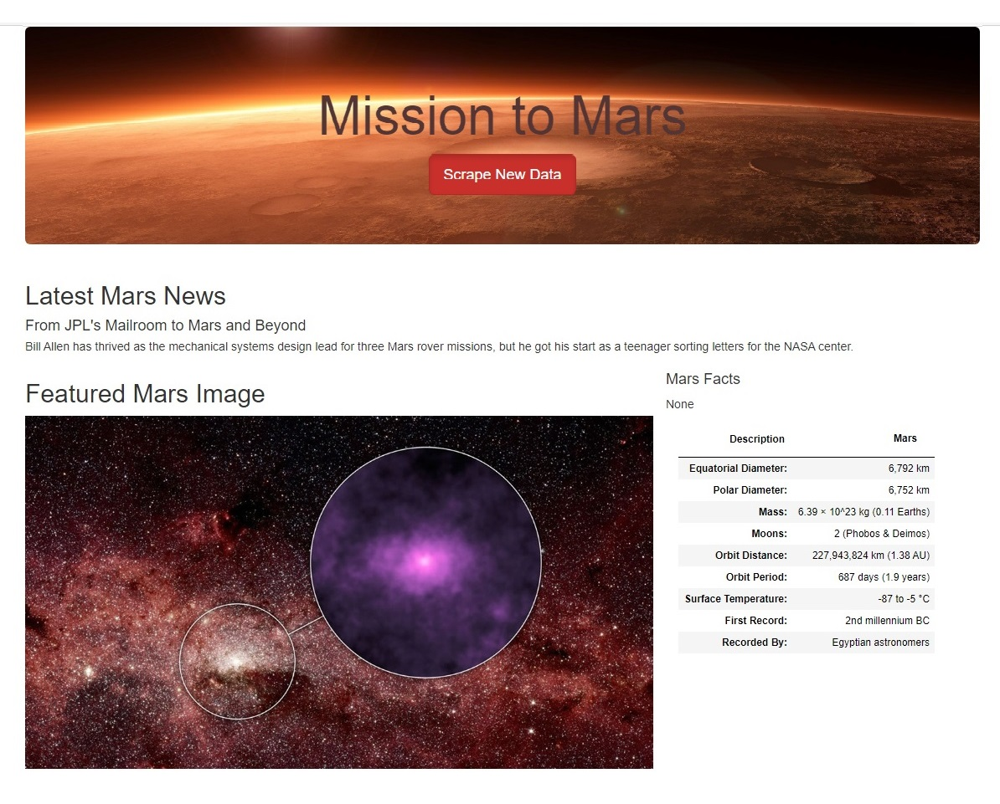

# Mission to Mars

## Project Overview
A web application with Flask that will automatically scrape different websites to extract data about Mars planet, store it in MongoDB database and display the information on a HTML page.

### Resources
Data Sources :  [MARS Planet Science](https://data-class-mars.s3.amazonaws.com/Mars/index.html),  [Jet Propulsion Laboratory](https://data-class-jpl-space.s3.amazonaws.com/JPL_Space/index.html),  [Galaxy Facts](https://data-class-mars-facts.s3.amazonaws.com/Mars_Facts/index.html),  [Mars Hemispheres](https://astrogeology.usgs.gov/search/results?q=hemisphere+enhanced&k1=target&v1=Mars)
 
Softwares : &nbsp;[Python](https://www.python.org/doc/essays/blurb/),&nbsp; [Pandas](https://www.anaconda.com/products/distribution),&nbsp; [Flask](https://flask.palletsprojects.com/en/2.1.x/tutorial/database/),&nbsp; [MongoDB](https://www.mongodb.com/docs/manual/tutorial/install-mongodb-on-windows/)
 
Data Environment : &nbsp;BeautifulSoup,&nbsp; Flask-PyMongo,&nbsp; Numpy,&nbsp; PyMongo,&nbsp; Splinter,&nbsp; webdriver-manager,&nbsp; Bootstrap3

## Scrape Full-Resolution Mars Hemisphere Images and Titles 
By taking steps :
- visit [Mars Hemispheres](https://astrogeology.usgs.gov/search/results?q=hemisphere+enhanced&k1=target&v1=Mars) website to view the hemisphere images.
- Use the DevTools to inspect the page for the proper elements to scrape, create a list to hold image URL string and title, and retrieve the full-resolution image for each of Mars's hemispheres.
- Print the list of dictionary items  
-  
- Check if image [links](https://astropedia.astrogeology.usgs.gov/download/Mars/Viking/syrtis_major_enhanced.tif/full.jpg) are working properly.

## Update the Web App with Mars’s Hemisphere Images and Titles
- Edit [scraping.py](scraping.py) file to :
  - Create a new dictionary to hold a list of dictionaries with the URL string and title of each hemisphere image.
  - Create a function that will scrape the hemisphere data and return the scraped data as a list of dictionaries with the URL string and title of each hemisphere image.
- Retrieving all of the data from Mongo database in [app.py](app.py) file.
- Modify the [index.html]() file to show the final result in a [web page](http://127.0.0.1:5501/index.html)
 

